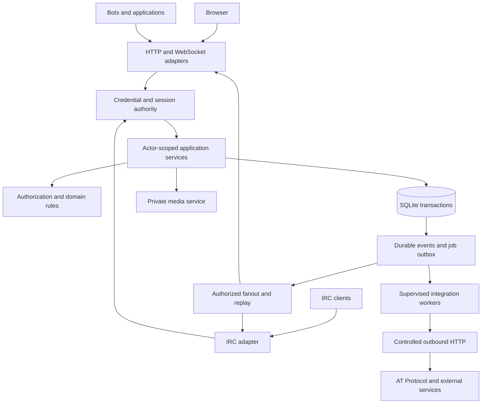

# Feature: Concord full remediation

## Summary

**Status:** complete design; implementation is in progress under the subsequent user authorization. Release qualification is not complete; see the [implementation ledger](concord-remediation/implementation-ledger.md). **Author:** Carmilla. **Date:** 2026-09-05. **Baseline:** `cff0df246b91461f959d8dbe9154ba50bba2331c` and the source hashes in the [evidence manifest](concord-remediation/evidence/source-manifest.json). See the [document verification record](concord-remediation/evidence/design-validation.md) for the original proposal's scope and structural checks.

Concord's north star, as stated in the [root README](../README.md), is a self-hostable modern community chat platform with native IRC compatibility and AT Protocol identity. This design makes that promise operational: communities control access to their content; accepted messages are durable; one identity works across multiple clients; advertised features have complete execution and recovery paths; and installation, upgrade, backup, and restore are supported product workflows.

The current code has valuable foundations: one Rust service, SQLite, a common chat event model, protocol adapters, parameterized queries, bounded connection queues, a React client, and substantial tests. Preserve them while replacing inconsistent authority, persistence, and delivery paths. Refactoring follows complete user operations rather than a wholesale rewrite or arbitrary file-size targets.

This document covers every finding from the codebase review and the additional persistence, configuration, and frontend gaps found while designing the repair. It includes the intended architecture, security policy, wire contracts, storage transitions, feature completion inventory, staged delivery, failure behavior, acceptance evidence, and rollback boundaries. It does not claim that any proposed endpoint, schema, module, test, or operator command already exists. Current paths are linked; future names are explicitly marked **proposed**.

The initial product decisions are: AT Protocol remains the supported human login mechanism; community content and ordinary uploads are owned by the Concord instance; external publication is deliberate and separately authorized; private channels and DMs are never automatically exported; SQLite remains the authoritative store; and the existing Discord-style feature ambition remains in scope. Live voice/video, federation between instances, and end-to-end encryption are separate product extensions, not substitutes for completing existing chat behavior.

## User-visible behavior

1. A new operator follows one verified installation path, creates the first administrator using a stable identity, configures TLS, and obtains a usable community without editing the database.
2. A member signs in, accepts an invite and current rules, and sees only conversations they can access. Search, unread counts, profiles exposed through membership, threads, attachments, and live updates follow that same boundary.
3. A member can remain connected through IRC, two browser tabs, and another device. Closing one connection does not make the identity disappear from the others.
4. Sending has an observable lifecycle. A message is pending until committed, becomes sent after durable acknowledgement, and remains recoverable if the connection or upload fails. Retrying one logical message does not create duplicates.
5. A reconnecting client resumes from a server cursor or receives an explicit resynchronization instruction. It does not silently miss messages, edits, deletions, permission changes, or moderation events.
6. Files in member-only conversations stay behind instance authorization. The UI distinguishes local content from deliberately published content and legacy uploads that were previously public.
7. Roles, private threads, moderation, invitations, notifications, bots, webhooks, and AT Protocol sharing behave consistently across restart and failure. Controls report actual completion and errors.
8. Operators can see degraded dependencies, storage pressure, failed deliveries, and upgrade readiness without logging message contents or credentials. A tested backup can restore messages, media, identity mappings, policy, and the necessary secrets.

## Requirements

All requirements below are mandatory for the final remediation release. Temporary restrictions during staged development do not count as completion. Each requirement maps to its same-numbered gate in Acceptance criteria.

- **R01 — Consistent authentication:** HTTP, WebSocket, IRC, bots, and delegated applications use one credential/session authority. Expiry, revocation, account disablement, and logout affect new operations and active connections consistently.
- **R02 — Consistent authorization:** every read, mutation, subscription, projection, count, and external delivery is authorized against the requester, resource, membership, and current policy. Database errors fail closed. Related resource IDs must belong to the same authorized scope.
- **R03 — Private media:** ordinary uploads use instance-controlled storage, attachment access follows conversation access, and publication and deletion have explicit lifecycles. Historical public PDS references receive an auditable migration outcome.
- **R04 — Safe outbound I/O:** URL resolution, redirects, bodies, response types, credentials, timeouts, and concurrency are controlled for previews, media imports, identity discovery, PDS requests, and outgoing webhooks.
- **R05 — Durable mutations:** acknowledgement follows transactional commit; message content, attachment links, deduplication receipts, and durable event records agree. Community and moderation mutations are atomic at their logical boundary.
- **R06 — Recoverable delivery:** replay, snapshot synchronization, deduplication, event retention, and queue overflow have explicit semantics. Durable events cannot disappear silently, and replay cannot restore content the actor may no longer see.
- **R07 — Stable identity and multiple connections:** preserve existing user identifiers, separate mutable handles and IRC nicknames from identity, support simultaneous sessions, and aggregate presence without connection replacement.
- **R08 — Correct IRC:** incremental framing, authentication, channel addressing, line limits, capabilities, heartbeat, and projection of modern features are tested over real streams and representative clients.
- **R09 — Durable DMs:** direct conversations have persistent participants, history, read state, attachments, edits, and offline delivery independent of online nicknames. Blocking and user delivery preferences are enforced.
- **R10 — Coherent contracts:** Rust and TypeScript share a mechanically checked protocol definition with versioning, stable errors, request correlation, validated payloads, and documented compatibility behavior.
- **R11 — Safe data evolution:** immutable migration history, checksums, integrity checks, fixture upgrades, deterministic repair, typed IDs, and timestamp/content compatibility preserve legitimate stored data.
- **R12 — Secure configuration and credentials:** reject known sample secrets, persist key material safely, bootstrap administrators by identity, bound credential verification, and support revocation and deliberate rotation.
- **R13 — Operable self-hosting:** reproducible packaging, supervised listeners/tasks, health/readiness, graceful shutdown, stable file locations, disk-pressure behavior, backup, and restore are complete.
- **R14 — Effective verification:** CI tests actual protocol and browser boundaries, negative cases, fault injection, migrations, packaging, and dependency health. Test counts and serialization coverage alone cannot establish feature completion.
- **R15 — Usable frontend:** accessible responsive navigation, multiline composition, drafts, pending/failed actions, retryable uploads, privacy cues, and keyboard interaction work across conversation changes and reconnects.
- **R16 — Complete messaging:** formatting, replies, reactions, mentions, edits/deletion, typing, read state, search operators, media/voice messages, pins, and bookmarks follow the shared model and survive their documented lifecycle.
- **R17 — Complete organization:** servers, categories, channel ordering, private channels, roles/overrides, threads/forums/tags, per-server profiles, custom media, and local server folders work end to end.
- **R18 — Complete moderation:** kick, ban, timeout, slow mode, AutoMod, bulk deletion, NSFW designation, and audit records enforce hierarchy, atomic state changes, and consistent access revocation.
- **R19 — Complete community workflows:** invites/vanity codes, discovery, welcome/rules, scheduled events/RSVP, announcement follows, and templates have validated, durable, authorized execution paths.
- **R20 — Complete integrations:** bot tokens authenticate usable routes/connections; scopes are enforced; incoming/outgoing webhooks, slash commands, components, rich embeds, and OAuth application grants have real execution, revocation, and failure paths.
- **R21 — Deliberate AT Protocol integration:** verified identity and profile sync remain functional; message publication is separately authorized, idempotent, observable, and recoverable; private content is not published by a global preference.
- **R22 — Bounded resource use:** queues, tasks, uploads, histories, searches, auth work, caches, retries, and jobs have budgets. A documented qualification workload demonstrates latency and recovery without weakening durability or authorization.
- **R23 — Honest documentation and capability reporting:** every advertised feature maps to a complete user journey and release gate; canonical install/configuration/protocol documentation matches built artifacts.
- **R24 — Useful observability and ownership:** errors retain context, tasks have owners and cancellation paths, diagnostic data is privacy-conscious, and subsystem boundaries make policy bypass and silent failure difficult.

## Acceptance criteria

Gate IDs are evidence obligations for future implementation, not claims that tests currently exist or pass. Store gate results with the immutable tested commit, toolchain, configuration, fixtures, and logs. Every gate must pass for the final remediation release.

- **G01 (R01):** a credential matrix exercises valid, expired, revoked, malformed, disabled-account, and legacy credentials through actual HTTP, WebSocket, IRC, and bot interfaces. Logout/revocation is durable across restart; affected active sockets stop accepting commands and delivering protected events. Tests include invalid WebSocket Origin and replayed OAuth callbacks.
- **G02 (R02):** owner/admin/member/nonmember/banned/removed/denied-role fixtures test each operation family in the access matrix. Private data, existence, counts, reply previews, media, presence, and fanout do not leak. Changing permission during a queued delivery or paginated read produces a denial or resynchronization, never stale authorized output. Storage faults never expand permissions.
- **G03 (R03):** upload/download/range/thumbnail/export/deletion tests prove conversation access, no automatic external publication, bounded streaming, crash recovery, and cleanup. Import fixtures yield an outcome for every legacy attachment, preserve IDs and checksums, and never claim that copying a public blob made previous publication private.
- **G04 (R04):** isolated HTTP/DNS fixtures exercise redirects to disallowed destinations, rebinding, IPv4/IPv6 forms, alternate ports, credentials across hosts, oversized/chunked/compressed bodies, invalid UTF-8, and timeouts. No forbidden connection occurs; memory and concurrency stay within configured budgets.
- **G05 (R05):** forced insert/link/event/audit failures produce no acknowledgement or partial mutation. Killing the process before and after commit proves the send state machine. Identical retries return one canonical result; conflicting reuse is rejected. SQLite runs the declared durability mode on every connection; storage-sync behavior has separate fault-test evidence.
- **G06 (R06):** snapshot/replay while concurrent writes, edits, deletes, and access changes occur converges with a fresh authorized snapshot. Duplicate/reordered notifications are harmless; cursor expiry, database restore, and queue overflow trigger explicit recovery. Replay neither resurrects deleted content nor acknowledges invisible events as visible.
- **G07 (R07):** one account on IRC and two web sessions remains connected with consistent delivery, presence, nickname updates, unread state, and per-session revocation. Fixtures include long handles, handle changes, legacy UUID IDs, DID IDs, bots, and nickname collision/reassignment.
- **G08 (R08):** byte-split tests cover every position in representative commands, partial UTF-8, several commands per read, EOF, cancellation, overlong lines, and clients that stop reading. A TCP/TLS suite and recorded manual runs with irssi or WeeChat plus one other client prove registration, channel discovery/JOIN, messaging, DM, history behavior, heartbeat, and reconnect.
- **G09 (R09):** an offline recipient receives a persisted DM after login; both parties can recover history and read state across devices. Third-party access, blocked senders, attachment misuse, reply IDs from other conversations, and disabled accounts are rejected. Ambiguous historical recipients are quarantined for repair without silent reassignment.
- **G10 (R10):** generated contract output is clean after regeneration; fixtures cover every command/event/error variant, invalid enum/range input, request IDs, protocol mismatch, and unsupported capabilities. Current web assets and the server handshake agree; legacy translation is exercised until its documented retirement.
- **G11 (R11):** fresh databases and populated fixtures for every historical schema version 1–16 upgrade to the target, or fail before changing authoritative data with a precise repair report. Foreign-key and integrity checks, FTS behavior, identity references, ordering, row counts, and attachment associations are verified. Interrupted upgrade/import can be resumed safely.
- **G12 (R12):** known sample, empty, malformed, or missing production secrets fail preflight; generated keys persist across restart with restrictive permissions. Bootstrap handles first login and handle changes using a stable ID. Rotation/revocation, encrypted credential recovery, corrupted key material, and lost-key failure are covered without logging secrets.
- **G13 (R13):** clean source/container builds, fresh install, non-root runtime, TLS setup, upgrade, SIGTERM shutdown, bind failure, storage exhaustion, and backup/restore drills pass. Health reflects listener and database readiness. A restored instance validates messages/media and starts external workers only after restore reconciliation.
- **G14 (R14):** CI runs format, strict lint, Rust tests, generated-contract checks, frontend checks, browser/socket journeys, migration fixtures, dependency review, and a container smoke test. Seeded regressions corresponding to E01–E12 are detected by the relevant tests. No blanket warning suppression or credential-dependent test silently reported as passing.
- **G15 (R15):** verified layouts at 360, 768, and 1440 CSS pixels, keyboard-only navigation, focus restoration, screen-reader review, multiline/IME input, conversation-scoped drafts, and retry/error flows pass. Reconnect, logout, permission loss, and two tabs do not expose another account's cached content or silently discard a failed composition.
- **G16 (R16):** feature journeys F01–F08 in the completion inventory pass through both adapters where meaningful. Search operators and Unicode boundaries are specified and tested; deletions remove protected previews/search/media access; bookmarks cannot bypass later revocation.
- **G17 (R17):** journeys F09–F13 pass, including private-thread restart, parent-child authorization, role hierarchy, concurrent reorder, custom emoji sharing policy, and ownership transfer. A private channel is inaccessible immediately after creation without requiring an additional manual permission fix.
- **G18 (R18):** journeys F14–F16 pass under concurrent sends, bot/webhook traffic, reconnects, and restarts. Audit evidence agrees with committed state. An invite or stale live subscription cannot bypass a ban; moderation cannot exceed actor hierarchy or grant authority the actor lacks.
- **G19 (R19):** journeys F17–F20 pass, including the last invite use raced by multiple clients, a failed join transaction, rules changes, private discovery suppression, invalid timestamps, cyclic announcement follows, and template instantiation into a new server.
- **G20 (R20):** journeys F21–F24 pass using a real local bot and mock external receiver: token auth/scopes, revocation, durable webhook retries, duplicate delivery, wrong-bot interaction response, expired interaction, malformed components, OAuth code/refresh replay, and uninstall all have verified outcomes.
- **G21 (R21):** journey F25 passes against controlled OAuth/PDS fixtures and a separately recorded real-provider canary before release. Provider outage/refresh races do not stop ordinary chat or private uploads; export retries and edit/delete reconciliation create no unintended copies. Prior global sync settings cannot publish private content.
- **G22 (R22):** the qualification workload and fault profile in Verification meets the stated latency/resource criteria with raw results and environment metadata. Load generators verify accepted-message counts and recovery, not merely throughput. Exhaustion produces explicit backpressure and bounded cleanup.
- **G23 (R23):** every F01–F26 inventory row has linked passing journey evidence and matching operator/user documentation. The documented installation is executed from a clean checkout. Unavailable capabilities are accurately reported; the final release cannot pass by hiding unfinished required features.
- **G24 (R24):** task-supervision tests observe failures and shutdown, diagnostics carry correlation IDs without secrets/content, and documented metrics reveal queue loss/recovery, commit failure, migration/import progress, and external job failures. Architecture checks show adapters cannot call unrestricted domain queries to bypass policy.

## Current architecture

The Rust workspace is [concord/Cargo.toml](../concord/Cargo.toml), containing [concord/server](../concord/server/Cargo.toml). [main.rs](../concord/server/src/main.rs) creates a SQLite pool, applies 16 migrations, creates ChatEngine, loads server/channel caches, starts IRC, and serves Axum HTTP/WebSocket routes. The React application lives under [concord/web](../concord/web/package.json).

| Boundary | Current implementation and consequence |
| --- | --- |
| Shared engine | [chat_engine.rs](../concord/server/src/engine/chat_engine.rs), 6,955 lines including tests: sessions, permissions, SQL, messaging, moderation, integrations, and background work share one implementation. Several synchronous methods call `block_in_place` to wait for async SQL. |
| Transport adapters | [ws_handler.rs](../concord/server/src/web/ws_handler.rs), [rest_api.rs](../concord/server/src/web/rest_api.rs), and [irc/connection.rs](../concord/server/src/irc/connection.rs) have different authentication and authorization checks. REST also computes permissions independently. |
| Durable state | [db/queries](../concord/server/src/db/queries/mod.rs) and [db/pool.rs](../concord/server/src/db/pool.rs) use SQLx/SQLite WAL with synchronous NORMAL, an optional engine database, and a custom SQL splitter/migration ledger. Runtime caches duplicate some persisted policy and membership. |
| Sessions/delivery | One nickname maps to one connection. The queue is bounded to 1,024 events, but a failed `try_send` is often ignored. Persistence tasks can finish after delivery/acknowledgement. |
| Identity/media | Human IDs can be DIDs after migration 014; historical UUIDs and bot IDs also exist. [web/atproto.rs](../concord/server/src/web/atproto.rs) handles OAuth, while [web/pds_client.rs](../concord/server/src/web/pds_client.rs) also owns file storage and publication. |
| Browser state | [chatStore.ts](../concord/web/src/stores/chatStore.ts), 1,710 lines, mixes normalized entities, transport, optimistic actions, notifications, settings, and integrations. [types.ts](../concord/web/src/api/types.ts) manually mirrors Rust events and commands. |
| Packaging | [Dockerfile](../concord/Dockerfile) pins Rust 1.84 and does not copy the workspace lockfile; source declares edition 2024 and uses later language features. Root/nested documentation diverges. |

### Evidence register

**Demonstrated** means a local probe or command observed the behavior. **Source** means the call path was inspected but the full scenario was not exercised. **Specification** identifies an external protocol constraint. This distinction remains part of implementation triage.

| ID | Evidence and affected code | Required response |
| --- | --- | --- |
| E01 | Demonstrated: REST returned a private message to a denied member; WebSocket returned it to a server nonmember. `web/ws_handler.rs::SearchMessages`, `web/rest_api.rs::search_messages`, `engine/chat_engine.rs::search_messages`. | R02, R10, R16; G02 and G16. |
| E02 | Source/specification: uploads pin public PDS attachment records; download ignores the authenticated identity beyond login and emits a public immutable cache policy. `web/pds_client.rs::upload_blob_to_pds`, `web/rest_api.rs::get_upload`. | R03, R04, R21; G03, G04, G21. |
| E03 | Demonstrated: a revoked JWT got 401 from REST and 101 from WebSocket, then executed search. `web/auth_middleware.rs`, `web/ws_handler.rs::ws_upgrade`. | R01, R12; G01 and G12. |
| E04 | Demonstrated: an SQLite trigger rejected the insert; the engine still acknowledged the message with zero persisted rows. `engine/chat_engine.rs::send_message`. Browser disconnected sends are source-confirmed silent no-ops. | R05, R06, R15; G05, G06, G15. |
| E05 | Demonstrated: IRC session registration removed the same identity's web session. Source: online-nickname DM routing, read-idle timeout without browser heartbeat, ignored queue overflow. | R06–R09; G06–G09. |
| E06 | Demonstrated on an exact helper copy: a complete IRC command returned; fragmented input stalled beyond the external two-second deadline. `irc/connection.rs::read_bounded_line`. | R08, R22; G08 and G22. |
| E07 | Source: outgoing webhook selection and AT message sync helpers lack runtime callers; BotAuth has no consuming route; no automatic thread archive worker was found. | R17, R20, R21, R23; G17, G20, G21, G23. |
| E08 | Source: outbound address checks are detached from connection/redirect resolution; preview response is fully read before truncation; byte slicing can break Unicode boundaries. `engine/embeds.rs`, `web/rest_api.rs::get_upload`. | R04, R22; G04 and G22. |
| E09 | Source: the example secret `change-me-to-a-random-secret` is not one of the values rejected by main's default-secret guard; administrator bootstrap occurs only at startup by username. | R12, R13; G12 and G13. |
| E10 | Source: thread creation sets `is_private` in memory, but `db/queries/threads.rs::create_thread` does not persist it; reload reads the stored flag. Parent-channel identity also depends on the parent message. | R02, R11, R17; G02, G11, G17. |
| E11 | Source: `chatStore.ts` discards notification settings and per-server nickname updates; the notification query's server-level DELETE/INSERT is not transactional. | R05, R15–R17; G05, G15–G17. |
| E12 | Source: permission query failures become default permissions/empty overrides; server creation, invites, and interaction responses cross incomplete transactional/authority boundaries. Migration 014 does not convert `channel_permission_overrides.target_id` for user-target overrides. | R02, R05, R11, R18–R20; corresponding gates. |

The baseline review ran 779 Rust tests successfully; frontend build and lint passed. Formatting failed, and strict Clippy found three test-code slice-clone findings. Dependency audit reported 10 findings, six high, without production-exploitability triage. These are baseline observations, not the remediation gates. Details and durable probe artifacts are in the [baseline record](concord-remediation/evidence/baseline.md).

## Proposed design

### 1. Ownership and dependency direction

Keep one deployable service. Split responsibilities within the existing crate before considering additional crates or processes. SQL is authoritative for persisted content and policy; caches are derived acceleration, never a separate source of authorization.



The **proposed** module ownership is:

| Owner | Existing code to move or narrow | Target responsibility |
| --- | --- | --- |
| `engine/identity` and `engine/authorization` | Session maps, `permissions.rs`, duplicated REST checks, nickname handling | Typed principals, session registry, membership/hierarchy/visibility decisions and policy versions. |
| `engine/messaging` and `engine/delivery` | Send/edit/delete/reaction/history/DM logic and broadcast helpers | Transactional commands, authorized queries, canonical messages, event descriptors, replay and fanout. |
| `engine/communities`, `engine/moderation`, `engine/integrations` | The corresponding ChatEngine method groups | Complete use cases with explicit actor/resource inputs and typed outcomes. |
| `services/media`, `services/egress`, `services/atproto`, `services/jobs` | PDS client, preview fetches, upload proxies, detached tasks | Storage, external protocol adapters, task ownership, persistent job execution. Engine code never imports `web` or `irc`. |
| `db` | Existing migrations/models/queries | Transaction-aware repositories and scoped projections; unrestricted helpers become crate-private implementation details. |
| `web`, `irc` | Current large dispatchers | Parse/authenticate, translate into application requests, encode validated results, supervise transport. No independent permission math. |
| Frontend domain stores and shared components | `chatStore.ts`, manual wire types, repeated dialogs/forms | Transport lifecycle separate from entities, composer/drafts, UI navigation, and domain-specific actions. |

Retain ChatEngine as a temporary façade so each flow can move without changing all callers at once. Remove obsolete entry points when their last caller migrates. Pure permission/value functions stay independently testable. Production construction requires a database and required services; in-memory substitutes live in test fixtures, so tests cannot accidentally validate a different no-database permission policy.

Use opaque validated UserId, ServerId, ChannelId, ConversationId, MessageId, CredentialId, and ConnectionId types. Existing IDs remain representable as stored strings; do not assume every historical identifier is a UUID. Distinguish an authenticated principal from a connection and from a display name. Application errors have stable codes, safe client messages, retryability, and internal context; preserve the underlying source error in logs. Do not stringify SQL failures into an apparent empty result or default permission.

#### Alternatives and tradeoffs

| Decision | Selected approach | Credible alternative and reason not selected |
| --- | --- | --- |
| Service architecture | One process with domain/application ownership and supervised workers; reuse existing protocol/domain work. | A full rewrite or distributed service split could create cleaner boundaries, but increases data migration, deployment, failure coordination, and rollback cost before repairing demonstrated bugs. Reconsider distribution only after measured capacity needs. |
| Authorization | Shared actor-scoped operations, transaction/snapshot-aware policy, versioned caches. | Adding more guards to each handler is a smaller patch and is useful for S1 containment, but preserves the mechanism that produced transport/search/fanout drift. It is not the final architecture. |
| Message acceptance | Transactional SQLite receipt/event/message commit, then authorized replay/fanout. | A broker-first design can scale delivery independently but adds another durable system and cross-store consistency problem. The single-store outbox is easier to restore and fault-test at this deployment scope. |
| Private media | Complete local instance storage plus separate deliberate publication. | Encrypted PDS blobs preserve external storage but require encryption, group-key distribution, device recovery, and IRC compatibility design. Object storage is a credible backend extension, but mandatory object storage increases first-run operator burden. |
| Browser sessions | Preserve JWT wire format while making recorded issuance/revocation authoritative. | Opaque server sessions are simpler once every request reaches the database. The retained JWT format narrows the immediate compatibility change; it is not used to justify stateless revocation or permanent duplicate authorities. |
| Permission precedence | Document/preserve current deny-wins tiers and add stronger membership/structural checks. | Adopting another product's exact precedence might improve familiarity, but can broaden legacy access and needs an explicit impact migration. Safety-preserving compatibility wins for remediation. |
| Migration runner | Retain the recognized legacy ledger, add immutable checksums/validation, and use driver script execution. | Switching to a different ledger/migration framework is reasonable, but its historical import introduces extra provenance and startup risks without being required to remove the custom SQL splitter. |
| Wire ownership | Rust-owned serialized DTOs produce a schema used for TypeScript types and runtime validation. | Schema-first generation of both Rust and TypeScript is viable but requires a larger replacement of existing Serde models. A working generator spike must prove the chosen Rust-first representation before committing the v2 contract. |

The selected choices preserve the ability to move one operation at a time, compare behavior through shared fixtures, and roll back an additive stage. None removes the need to complete the feature inventory or permits weaker privacy/durability to obtain a passing benchmark.

### 2. Authentication, identity, and credential lifecycle

The **proposed** AuthService returns an Actor containing stable user/principal ID, credential ID, allowed credential scopes, and session expiry. Actors are constructed only by trusted authentication or audited system-job paths. The application never treats caller-supplied user IDs as authentication.

Initially retain the JWT cookie format to minimize unrelated wire changes, but make a durable web-session row authoritative. Add credential/session generation and revocation state; JWT `jti` identifies a recorded issuance. REST and WebSocket use the same validation function. A live connection retains its credential ID and expiry, receives revocation notifications, and checks authority on each command. Delivery consults connection validity. Logout revokes that browser session; a separate account action revokes all sessions. A revoked IRC/bot token closes connections authenticated by that token. Clearing a cookie is not sufficient revocation.

At cutover, invalidate unregistered legacy web JWTs and require login again; their missing durable issuance/revocation history cannot be reconstructed safely. Preserve IRC and bot token records and migrate their verification path. New random tokens carry a nonsecret token ID for indexed lookup, avoiding scans of every salted hash. Existing tokens can use their verified legacy format until rotated. Bound verification concurrency and keep expensive hashing off async I/O workers; rate-limit before verification.

Preserve `users.id` values already in use, including DID and historical UUID values. Provider identity remains a unique mapping from verified provider subject to UserId. Handles, profile names, server nicknames, and IRC aliases can change without rewriting message ownership. Verify DID/handle/PDS relationships through the AT OAuth profile; a user-submitted handle is not authority for the token's subject. Preserve PKCE, PAR, DPoP/nonce handling, issuer/subject checks, and browser-bound one-use state, with expiry checked when consuming the callback. Scope external access to the requested feature. Follow the [AT Protocol OAuth profile](https://atproto.com/specs/oauth).

External credentials are encrypted with authenticated encryption under an operator-managed key kept outside the database, with a key identifier and rotation procedure. Do not implement cryptography locally. A provider refresh is serialized per account; a compare-and-swap credential version prevents stale refresh responses overwriting newer state. Corrupt/missing key material produces an explicit degraded/recovery state, not silent key replacement. Existing local sessions and local media remain usable during PDS failure; new OAuth logins may legitimately fail.

Require secure, HttpOnly cookies in production, origin checks for WebSocket and cookie-authenticated mutations, and CSRF protection appropriate to the same-origin browser flow. Validate the configured URL as an origin rather than using a string prefix to recognize localhost. Only explicitly configured reverse proxies may provide client-address headers. Instance administrators manage the instance; membership/role policy governs normal community access. Any application-level administrator access override must be explicit and audited. The hosting operator remains trusted with stored plaintext; this design does not assert end-to-end encryption.

### 3. One authorization model for every surface

The **proposed** AuthorizationService evaluates `actor + action + resource` using a consistent database snapshot. Credential scopes cap, rather than extend, the user's domain permissions. Nonmembership and active bans are denied before evaluating the server's default role. Resource ownership and parent/server relationships are loaded by ID, never trusted from a parallel request parameter.

Keep the current deny-wins behavior within an override tier as Concord's explicit initial policy, because silently changing precedence can grant access. Document it rather than claiming exact compatibility with another product. Preserve the ordering of default role, aggregate roles, channel overrides, and per-user overrides, and test conflicting allow/deny combinations. Owner and server administrator bypass applies within that server's channels, including private threads, not other servers or DMs. Role creation/assignment cannot grant permissions or hierarchy position beyond the actor's authority; ownership transfer is a dedicated transaction.

Use precise terms: **member-visible channel** is not public on the internet. **Private channel** additionally requires an explicit visibility grant. Creation atomically installs the default denial and authorized creator/role grants. **Private thread** requires parent visibility and explicit thread membership, subject to the documented owner/admin access policy. Store its parent channel independently of the parent message so message deletion cannot accidentally remove or orphan its authorization boundary. Public threads inherit their parent's visibility upper bound.

| Operation family | Required scope and behavior |
| --- | --- |
| Server/channel lists, discovery, invite preview | Anonymous callers see only deliberately published discovery/preview fields. Membership is required for internal lists; channel lists filter visibility. A discoverable server does not make its history public. |
| History, search, replies, pins, bookmarks, thread/forum lists | Membership plus current conversation visibility; history permission where applicable. Apply authorization before pagination, counts, snippets, and reply expansion. Hidden or removed targets return a uniform unavailable result. |
| Messages, edits, deletes, reactions, typing, read state | Conversation access plus action permission; author/manager rules and moderation restrictions. Parent/reply/attachment IDs must match the same conversation or an explicitly authorized operation. |
| Attachments, thumbnails, range requests, embeds | Attached content inherits the live message/conversation policy; staged uploads belong to their uploader and designated conversation. An attachment ID is not a bearer capability. |
| Roles, categories, reorder, templates, server settings | Membership, action permission, hierarchy, and exact resource ownership. Batch operations validate every item before committing any change. |
| Profiles, member lists, presence, nicknames | Return only the intended public profile fields or authorized shared-community information. Invisible status appears offline; private membership is not inferred through presence lists. |
| Moderation and audit | Server/conversation scope, hierarchy, and separate audit permission. Mutations and audit entries commit together. Ban/removal invalidates live subscriptions and scheduled jobs. |
| Bots, webhooks, commands, components, external export | Credential scope intersected with install grant and current resource permissions. Bound tokens to their intended server/channel/application. Recheck before delivery; external systems are recipients with explicit grants. |

Search parses `from:`, `in:`, `has:`, `before:`, and `after:` into a typed query with bounded length/operators/page size. Validate dates and supported attachment filters; invalid filters produce an error, not an unfiltered search. Construct parameterized SQL with authorized channel IDs or an equivalent policy-aware query. Never load a page and remove denied rows afterward: that leaks counts and breaks pagination. Use a bounded transaction/snapshot for results and totals. A continuation token carries the query fingerprint and authorization version; policy changes require a fresh authorized page.

Policy changes increment a persisted server/conversation authorization version in the same transaction. Cache entries carry that version. Mutations authorize inside the write transaction; read projections authorize in their read snapshot. In-process delivery serializes policy invalidation with authorization-to-enqueue decisions for the affected scope. Queue entries reference events/resources, not irrevocably authorized payload copies; the final writer validates credential and policy version before serialization. Revocation flushes affected queued descriptors. Bytes already written to a client cannot be recalled; the promise is that new authorization/delivery decisions after committed revocation do not use the old grant.

### 4. Transactional commands and durable message acceptance

The **proposed** MessagingService has async operations for send, edit, delete, reaction changes, and read state. HTTP, IRC, bots, webhooks, and interaction responses converge on these operations. They do not retain bespoke persistence or broadcast shortcuts. Authorize and enforce message length, attachments, rate limits, timeout, slow mode, archive state, and AutoMod consistently for each principal type; any exemption is an explicit scoped permission.

A send follows this sequence:

1. Parse a validated request with request ID, client message ID, conversation ID, content format, attachments, and optional reply. Bound work before acquiring a transaction. Expensive external operations never occur inside it.
2. Acquire an admitted write transaction. Validate credential/current membership and action permission, resolve referenced resources, and enforce slow mode/AutoMod using authoritative state.
3. Look up the idempotency key `(principal_id, client_message_id)`. Identical canonical payloads return the prior committed receipt after rechecking present access; a different payload returns `IDEMPOTENCY_CONFLICT`. Rate limits do not make a successful retry look like a new send.
4. Allocate a conversation message sequence. Insert the canonical message, validate/claim staged attachments, record structured mentions, update activity, and insert the command receipt plus durable event/outbox metadata in the same transaction.
5. Commit. Only then acknowledge with canonical message ID, sequence, persisted timestamp, and request/client IDs. Publish a wake-up hint to delivery workers; durable rows, not the hint, guarantee recovery.
6. Authorized subscribers, including the sender's other connections, receive the same canonical event. The sending connection can receive both receipt and event; the client deduplicates by identity/sequence.

| Interruption | Required observable outcome |
| --- | --- |
| Validation/permission failure | Rejected action with correlated stable error; no partial mutation. |
| SQL, attachment claim, event, or audit insertion fails | Roll back; no success acknowledgement or success event. |
| Process dies before commit | No accepted message; retry may create it once. |
| Commit succeeds but acknowledgement is lost | Retry returns the existing receipt; no new row. |
| Commit succeeds but wake-up/fanout fails | Replay/outbox discovers the committed event; sender can recover by client message ID. |
| Optional preview/provider fails | Core message remains accepted; optional work has a visible retry/failed status where relevant. |

Use SQLite WAL with synchronous FULL for the durable production profile. NORMAL does not promise survival of an OS crash/power loss; application-crash tests alone cannot prove that stronger guarantee. Set and verify connection pragmas explicitly, record the filesystem/storage assumptions, and test the declared profile. This choice follows [SQLite's durability semantics](https://www.sqlite.org/pragma.html#pragma_synchronous).

Apply the same transaction discipline to server-plus-default-channel/roles creation, invite consumption-plus-membership, moderation-plus-audit, role/override updates, notification upserts, ownership transfer, and integration grant changes. In-memory indexes update only from committed results; a failed cache update triggers invalidation/reload, never rollback of an already acknowledged transaction. Long-running import or publication uses explicit durable job states rather than a transaction held across network I/O.

### 5. Replay, fanout, presence, and backpressure

Separate durable state changes from ephemeral hints. Messages, edits/deletes, reactions, membership/permission changes, and committed integration outcomes have durable event references. Typing and intermediate presence updates are ephemeral and may be coalesced; losing them must not affect unread counts or content correctness. Server-side persisted messages are the authority after reconnect.

The **proposed** internal event cursor is `(database_generation, event_sequence)`. Allocate monotonically increasing event sequences transactionally; message sequence is separately monotonically increasing within a conversation. The wire cursor is an opaque authenticated/encrypted token bound to the principal and subscription scope, so global sequence gaps do not reveal other communities' activity. Exposed conversation sequence numbers are decimal strings on the JSON wire to avoid JavaScript precision loss. A cursor is not proof of permission to inspect an event.

On a new connection, authenticate, negotiate protocol/capabilities, and load an authorized snapshot at high-water mark H. The dispatcher then replays committed events after H and transitions to live delivery without a gap. On reconnect, replay from the last fully applied cursor if retained. Snapshot and replay are scoped to the requesting principal and current subscription set. A cursor older than the retained log, an incompatible protocol, or a new database generation returns `RESYNC_REQUIRED` with a reason; the client replaces relevant cached state with a fresh snapshot.

Replay must respect deletion and revocation as they exist now. Store event descriptors and entity versions; resolve content through current authorized projections. Deleted content becomes a tombstone even if an old create event is replayed. Clients compare entity versions so stale creates/edits cannot overwrite newer state. Private metadata events need the same filtering as messages. A reset replaces stale search/member/channel state, not just the visible message list.

The dispatcher keeps an observed event high-water mark, polls durable rows when wake-up hints are missed, and batches authorization for recipients sharing a policy snapshot. Every connection has a bounded descriptor queue plus a byte budget. On durable-queue overflow, mark the connection desynchronized, prioritize a control message, and close if the control frame cannot be sent promptly. Recovery is cursor-based; silent durable event loss is forbidden. Ephemeral queues may discard older typing/presence hints. Do not allocate one detached task per recipient/message.

Maintain indexes from UserId to a set of ConnectionIds, from authenticated credential to its connections, and from conversation to active subscriptions. Connection cleanup removes only that connection. A nickname identifies a user, not one transport session. Aggregate online/idle from connected activity unless the user selected DND or invisible; invisible projects as offline. A final connection closure changes aggregate presence. Persist user-selected status separately from transient connection liveness.

Use server WebSocket ping frames with a timeout independent of application commands, and an application heartbeat/status signal if the browser needs latency diagnostics. IRC gets server PING/PONG with deadlines. Reconnect uses capped exponential backoff with jitter and distinguishes authentication failure from network failure; failed authentication stops an infinite retry loop and returns to login. Admission limits account for legitimate devices behind the same NAT and cap both per-principal and per-address resource use.

### 6. IRC and durable direct conversations

Replace the custom read loop with a bounded incremental decoder that consumes buffered bytes into owned framing state and yields when awaiting more bytes. Bound the entire line including terminator; find-newline must not bypass the cap. Define invalid UTF-8 handling at the adapter boundary, preserve the next complete line when rejecting malformed input where safe, and close abusive connections deterministically. All error/close paths release writer tasks, engine subscriptions, and per-IP counters.

Keep legacy IRC registration, PASS-token access, and implemented SASL support, with TLS required for credentials on public listeners. Plaintext operation is an explicit loopback/test choice. Select caps from a tested capability registry; never advertise a capability merely because its token parses. Server-time tags use persisted UTC timestamps when negotiated, consistent with the [IRCv3 server-time specification](https://ircv3.net/specs/extensions/server-time). Add history/echo or other IRCv3 extensions only with their full negotiation and behavior tests.

Replace server display-name routing with a stable unique IRC alias for each server and a stable alias for each user that satisfies IRC/client constraints. Preserve working old channel aliases through an alias table where unambiguous; do not use a mutable display name as a routing key. `#server-alias/channel` is canonical. Bare `#channel` requires an explicitly selected/default server that exists and is accessible. First-run setup chooses that server; absence produces a helpful error, not an implicit nonexistent `default` server. Long Bluesky handles remain valid identities even when an IRC alias is shorter.

| Modern behavior | IRC projection |
| --- | --- |
| Plain/Markdown text | Send readable text with server prefixes escaped/validated; format at the adapter boundary. Split overlong output at UTF-8 boundaries within negotiated line limits. Do not silently truncate persisted content. |
| Attachments | Include named authenticated download links with a clear web-login requirement. Private files do not become public merely to make terminal fetching convenient. |
| Edits/deletion/reactions/threads | Use negotiated extensions where fully implemented; otherwise deliver a concise, correctly scoped notice referencing the original message. Private thread metadata obeys thread access. |
| Reply/history timestamps | Preserve canonical message IDs/times where the capability supports them; otherwise show an intelligible reply/history projection. |
| Unsupported rich component interaction | Show text/fallback link to the authorized web conversation. Never claim that a terminal client executed a button or select control. |

Introduce **proposed** direct-conversation and participant records. A one-to-one conversation has a unique canonical pair of UserIds, with transactional get-or-create. Each DM message references the conversation, not a currently connected nickname. Resolve an IRC nickname to a stable identity before submission; offline identity lookup uses the persisted alias map. Recipient delivery occurs on their next authorized session, and existing web clients gain a DM list, history, unread state, composer, and participant navigation.

Users can block identities and choose whether new DMs are allowed from shared-server members or all known identities. Default new conversations require a shared server; existing conversations remain readable after server departure unless an account is disabled, and blocking prevents new messages without deleting history. These are application controls; the operator remains able to inspect its stored data. Only participants can access DM content through ordinary APIs. Server moderators do not gain DM access through a server role. Group DMs are outside this remediation's baseline.

### 7. Private media and attachment lifecycle

Choose an instance-owned local filesystem backend for ordinary attachments in the first remediation release, behind a storage interface. This completes self-hosted operation without adding an object-store dependency. Public PDS publication remains a separate explicit action. An object-store backend can be added later without changing AttachmentId or authorization; it is not required to make the local backend complete.

The **proposed** media states are `staging`, `ready`, `attached`, `deleting`, `deleted`, `failed`, and `legacy_external`. Each record has an owner, designated conversation, byte size, media type, checksum, storage key/backend, retention timestamps, and state version. A database record never names an arbitrary user-chosen filesystem path. Object keys are generated; filenames are display metadata. Deduplication, if enabled, is internal and cannot reveal another user's file existence.

1. Create an authorized upload intent for a specific conversation and reserve quota. Stream to a restricted staging directory with request and byte limits; do not buffer the complete file in Rust memory. Abort/disconnect returns reservations after bounded cleanup.
2. Verify byte count, checksum, allowed content type, and minimal safe media handling. Mark ready only after content is durably stored. Use atomic rename on the same filesystem, synchronize the file and containing directory as required by the declared durability profile, then commit its ready metadata. An unreferenced durable object is recoverable garbage; a ready row must not point at missing bytes.
3. Send-message atomically claims ready attachments owned by the actor and intended for the same conversation. Reject cross-user claims, already-claimed attachments, duplicates, and changes to inaccessible conversations. Attachment-only messages are valid structured messages, not a zero-width-space workaround.
4. A download resolves current message and conversation access before returning content. Range requests and thumbnails repeat that authorization. Use private/no-store caching initially, restrictive content disposition, `nosniff`, and a separate media origin or sandbox CSP for active/untrusted types. Do not render uploaded SVG/HTML as trusted inline application content.
5. Unsent staging expires after the configured grace period. Message deletion immediately removes attachment access; a supervised cleanup job removes physical unreferenced bytes after the recovery grace period. External copies have separate statuses and cannot be claimed deleted until confirmed.

Media preview/transcoding is bounded and isolated from the main request runtime. Preserve the uploaded original and make metadata stripping/transformed previews an explicit documented policy. Browser voice recordings, waveform/audio previews, image/video previews, GIF URLs, custom emoji/stickers, avatars, and banners use the same safe media/read policy where they are managed assets. Temporary browser recording/object URLs are revoked on completion/cancellation. Failed individual uploads remain available for retry; sending only a successful subset requires the user to choose that outcome.

For existing PDS uploads, stop automatic external upload/pinning first, while preserving read access behind repaired authorization. Inventory each AttachmentId, uploader, attached message/conversation, CID, upstream URL, stored size/type, and known record reference. Import using controlled egress, compare actual size/checksum, durably write local bytes, then atomically switch the storage locator. Keep IDs, message links, provenance, and previous external URL in a restricted migration ledger. Do not stream through the old private-source URL to an unauthorized requester during import.

The old pin helper does not retain its created record URI in the attachment row. Where authorized provider credentials exist, reconcile only the application's attachment collection by account and CID, retaining evidence; ambiguous/multiple references are reported, not guessed. Download failure, missing credentials, or missing data yields a specific per-item outcome. An operator can complete migration with an explicit unresolved-file inventory and visible unavailable attachments; it cannot report all media recovered when it was not.

Previously published files may remain public at their PDS or in third-party copies. Importing locally does not reverse that fact. Provide an exact list of application-owned external references for a separately authorized cleanup action; do not delete unrelated user records or assume removal can erase copies. UI labels and operator reports retain `previously_public` provenance. Local rollback can restore the old locator only when it would not reopen an unauthorized route; otherwise retain the private local copy and roll forward.

### 8. Controlled egress and provider jobs

One **proposed** EgressService owns network policy and client construction for user-controlled destinations. Policy variants distinguish public previews, provider OAuth/PDS endpoints, authenticated publication, and administrative webhooks. Credentials are attached only to their verified intended origin. Configured private infrastructure requires an explicit operator allowlist scoped to the relevant integration; no global production bypass is exposed to ordinary users.

Parse scheme/host/port and reject embedded credentials and forbidden destinations. Resolve all relevant addresses, validate canonical IPv4/IPv6 including mapped forms, and bind the connection to those validated addresses while preserving TLS hostname verification. Re-evaluate every redirect; credential-bearing operations reject cross-origin redirects. Prefer redirect rejection for webhooks. Bound DNS/connect/header/body/total times, redirect count, decompressed bytes, parsing work, and concurrent requests. Enforce streaming limits before accumulation and decode/truncate only at valid text boundaries. This policy addresses the reviewed code paths and follows [OWASP's SSRF guidance](https://cheatsheetseries.owasp.org/cheatsheets/Server_Side_Request_Forgery_Prevention_Cheat_Sheet.html).

Dependency discovery that happens inside an OAuth/identity library must be covered by the same network policy or an independently verified equivalent. Wrapping only Concord's obvious GET calls is insufficient. Verify the selected library's actual injectable HTTP/resolve/redirect API at implementation time; if its hidden transport cannot enforce the policy, replace that adapter/library before enabling the flow. Current Reqwest supports explicit resolution overrides, but those APIs alone do not prove redirect or connection-reuse safety. [Reqwest ClientBuilder](https://docs.rs/reqwest/0.12.28/reqwest/struct.ClientBuilder.html#method.resolve_to_addrs)

Use a persisted job/outbox table for external side effects. Jobs contain a deduplication key, operation type, resource/version, destination grant, attempt count, next-attempt time, lease, state, and safe error code. Workers are supervised, claim bounded batches, renew/release leases, and resume abandoned work after restart. Backoff is exponential with jitter and respects a bounded Retry-After. Permanent validation/auth failures stop retrying and surface a repair action. After the configured retry horizon, retain a failed/dead-letter record with manual retry; never silently discard required delivery. Preview refreshes may expire as best-effort work without changing message acceptance.

Recheck source visibility, destination/install grant, and deletion state before each external attempt. A removed webhook or revoked grant cancels queued deliveries. Outbound payloads contain only the authorized projection. Do not write message content, credentials, token-bearing URLs, or response bodies into ordinary logs. Record operation IDs and safe endpoint identifiers. Network failures are isolated from the core chat transaction.

### 9. Integration contracts and deliberate publication

Incoming webhooks authenticate a scoped credential and call the same message command as other principals. They receive a canonical receipt and support a client idempotency key. Preserve a distinct webhook identity/display marker, enforce size/rate/channel/archive rules, and explicitly define any granted moderation exemptions. Do not fake a human sender identity or bypass attachment authorization.

Outgoing webhooks subscribe to named durable event types within an installation grant. Create a job transactionally with the relevant event or deterministically from it. Deliver a stable delivery ID, timestamp, event version, and signature using a rotatable per-webhook signing secret. Receivers may receive duplicates and must deduplicate by delivery ID; UI and docs say at-least-once, not exactly-once. Expose attempts/status and a synthetic test event. A 2xx receipt completes delivery; retry policy handles timeouts, 429, and transient 5xx. Signing material must be recoverable/encrypted because a one-way token hash cannot sign outbound requests.

Bot credentials authenticate documented HTTP routes and a bot WebSocket path/handshake, with explicit scopes intersecting the bot's installation membership/roles. Registration and installation are separate operations. Token creation shows the secret once; list responses never contain usable secrets. Revocation/uninstall invalidates active connections and queued jobs. Existing human cookie authentication is not a workaround for missing bot auth.

Slash-command invocation validates the installed command schema, caller access, arguments, and target channel before recording an interaction. Store the intended application/bot ID, invoker, expiry, response state/version, and an interaction-specific reply credential. Only that bot/application can respond. Atomically accept the first response or documented update transition; reject wrong-bot, expired, or duplicate conflicting replies. A public response is a normal authorized channel message; an ephemeral response goes only to the invoker's authorized sessions and has bounded retention. It is never broadcast to every server member. Components reference an installed handler and validated action data; rich embeds and component JSON use the versioned contract and safe rendering limits.

Complete the existing OAuth application surface as a bounded delegated-access service: registration, exact redirect validation, authorization-code consent, PKCE, one-use short-lived codes, access/refresh issuance, refresh rotation/reuse handling, scope checks, token revocation, and uninstall. Public clients have no assumed secret; confidential credentials and grants are stored safely. No implicit/password grant is added. Consent describes server/channel access and publisher identity; authentication alone cannot create a grant. Follow [OAuth security best current practice](https://www.rfc-editor.org/rfc/rfc9700.html), with tests of the actual issuer endpoints. This is distinct from Concord acting as an AT Protocol OAuth client.

AT profile synchronization updates verified handle/display/avatar fields without changing UserId. Ordinary messages and uploads do not depend on successful profile refresh. Manual sharing and automatic record sync require both author opt-in and an explicitly publication-enabled channel. Private channels, private threads, and DMs are ineligible. Existing global `atproto_sync_enabled` is retained as a migrated preference but cannot enable publication by itself; users must select the eligible scope. Membership records and private channel subscriptions are not published as an incidental side effect.

For export, create a durable publication record before remote work, with deterministic operation/record identity, source message version, destination/collection, remote URI/CID, and status. Reconcile a timeout-after-remote-success before retrying creation. Edit and delete schedule versioned update/removal work and preserve remote identifiers. Remote failure does not roll back a local message; it changes publication status and provides retry/re-authentication. Recheck deleted/private state immediately before dispatch. The AT blob model makes publication public; unreferenced uploads can be temporary, so successful pinning and retained remote identity are part of the export result. [AT Protocol blob lifecycle](https://atproto.com/specs/blob)

### 10. Frontend state and interaction design

Separate four concerns: normalized domain entities; connection/synchronization state; pending command/upload state; and navigation/composer state. Keep Zustand initially and the existing virtualized message list. Smaller domain stores and selectors prevent every event from rebuilding unrelated server/moderation/integration state. Shared forms, dialogs, menus, error presentation, and theme tokens replace repeated custom behavior.

The **proposed** connection states are `connecting`, `authenticating`, `synchronizing`, `ready`, `reconnecting`, `resync_required`, and `signed_out`. Socket-open does not imply subscriptions/history are ready. Commands return a correlated acceptance/rejection promise or a recorded offline pending action; they never silently disappear. Guard stale fetches and responses with account, conversation, and request generation so switching channels cannot inject results into a new view.

The composer is a multiline textarea with IME-safe Enter/Shift+Enter behavior, optional send-on-enter preference, selection-aware mentions, drag/drop/paste uploads, and a visible file queue. Drafts are scoped by instance, account, and conversation; default local persistence has a clear private-data setting and clear-on-logout behavior. Pending messages retain their original request/client ID across retry, distinguish explicit rejection from unknown outcome, and reconcile canonical server content instead of merely replacing an optimistic ID. A timed-out send is checked by ID before offering a new logical send. Do not clear text/files as if accepted when transport submission failed.

Keep structured source text as the new canonical content representation and escape/render at the output boundary. The current server pre-escapes HTML; existing rows are not safely recoverable by blindly decoding entities because literal entities and historically different write paths can be ambiguous. Add an explicit content-format/version marker and preserve historical bytes as legacy format. New Markdown rendering permits a defined syntax, disallows raw active HTML, validates link schemes, and handles spoilers/code/quotes safely. Edit migration of a legacy message produces explicit new-format content while preserving its identity/version history policy. Length limits have named units: bytes for wire/storage safety and Unicode-aware display limits; external character/grapheme limits use that provider's actual current contract.

Notification settings are real state with one schema vocabulary (`all`, `mentions`, `none`, `default`), defined channel-over-server inheritance, and mute expiry. Server-derived mention targets and monotonic read cursors drive unread/highlight decisions. DND, everyone/role suppression, invisible status, and per-conversation mute apply before desktop notifications; browser permission is requested by an explicit user action. Coordinate notification delivery across tabs to avoid multiple desktop alerts for one event. Viewing a background tab does not mark messages read. Read receipts record a visible conversation sequence, not arbitrary timestamps.

On narrow layouts show one primary pane, with server/channel navigation and contextual panels as drawers. On wider layouts permit bounded side panels without collapsing the message area. Every dialog has a focus trap, named controls, Escape/close behavior, and focus restoration; keyboard shortcuts avoid editable fields and IME composition. Permission-aware menus hide or explain unavailable actions, but the server remains authoritative. Provide loading, empty, offline, revoked-access, and failed-operation states for every core panel. User profiles and per-server nicknames/avatars update reactively rather than discarding their events.

### 11. Community and moderation behavior

Server membership, persistent private grants, transient subscriptions, and role assignments are separate concepts. Joining an open member-visible channel subscribes a connection; it does not create an unauthorized server membership. Invites validate expiry, ban state, intended server/channel, rules requirements, and use limit in the same transaction as membership. Reusing an invite when already a member is idempotent and does not consume another use. A failed membership insert cannot consume the final use. Vanity links resolve through the same policy rather than a second bypass.

Rules have a version and acceptance record. A member awaiting acceptance can access the explicitly allowed welcome/rules surface but cannot chat until acceptance; rules changes do not silently reinterpret a previous acceptance. Discovery exposes curated public metadata only. Templates copy a versioned allowlist of configuration into new IDs, remap role/category/channel relationships, and exclude members, messages, secrets, private attachment URLs, and grant tokens. Template instantiation is atomic or exposes a resumable provisioning state before the new server is joinable.

Channel/category reorder validates a complete bounded operation within one server and writes positions transactionally. Role and permission edits validate all targets and hierarchy before mutation, increment authorization versions, and emit only authorized results. A private thread persists its type, private grants/membership, parent channel, archive policy, and last activity. Auto-archive jobs use durable due times and conditional updates so a concurrent new message cannot be archived as inactive. Manual archive/unarchive rules are distinct from inactivity; tags belong to their forum and moderated tags require the appropriate authority.

Scheduled events validate UTC timestamps and end-after-start; optional linked channels are visible to the participants who receive details. Workers advance event states idempotently after restart. RSVP changes use a unique actor/event record. Announcement follows require an explicit readable publication source and authority to write the destination; recheck both grants at dispatch. Preserve source/destination message lineage, reject cycles, deduplicate, cap fanout, and propagate edit/delete according to a documented policy. Private content cannot become an announcement source through a follow.

Moderation commands use the shared actor policy and hierarchy for humans, bots, webhooks, and jobs. Timeout and slow mode consult authoritative time/state inside acceptance, so concurrent sessions cannot evade them. AutoMod validates bounded rules at creation, evaluates before acceptance, and defines delete/reject, timeout, and flag outcomes. Flagging produces a restricted moderation record; rejection never sends content as an accepted message. Configuration/read failure fails the affected operation explicitly. Bulk delete checks all IDs belong to the intended conversation and commits deletion/audit/events consistently.

Kick, ban, removal, and role reduction revoke affected access and subscription descriptors. Ban cleanup windows operate only in the specified server with recorded progress; they cannot delete unrelated DMs or another server's messages. Audit entries preserve the actor's identity snapshot even if an account is later deleted; do not cascade away moderation history unintentionally. Audit content excludes secrets and limits stored message content to an explicit retention policy. NSFW designation remains an enforceable client/server channel attribute without inventing an age-verification system in this remediation.

### 12. Configuration, process supervision, and operations

Consolidate the duplicate configuration/auth loading paths into validated configuration with typed bounds and named secret-file inputs. Reject empty and known example secrets, invalid negative/overflowing durations/sizes, malformed URLs, partial TLS settings, and inaccessible data paths before binding public listeners. Parse errors identify the field without printing its secret value. Generate persistent secrets only during explicit first-run setup; a corrupt/missing established secret never silently becomes a new ephemeral secret.

Use a stable DID/UserId administrator allowlist or a local one-time bootstrap flow with a recorded consumption state. Bind the first authenticated verified identity deliberately; a mutable handle string is not ongoing privilege authority. Bootstrap works both before and after first login without requiring a second process restart or manual SQL. Administrative transfer and recovery are documented local operator actions with audit records.

The root supervisor owns web/IRC listeners, connection tasks, delivery, archive/event workers, credential cleanup, outbox, media cleanup, and observability. A required listener bind/task failure prevents readiness or shuts down the service with a nonzero result; a detached panic cannot leave a misleading healthy half-service. Shutdown handles SIGINT and SIGTERM, stops admission, finishes/aborts in-flight work according to transaction state, signals sockets, releases leases, and waits up to a configured deadline. Durable jobs recover after forced termination.

The **proposed** `/health/live` reports process liveness and `/health/ready` checks required listeners, compatible schema, usable database/media path, and write-admission state. Optional provider outage appears as a degraded dependency, not as an unusable chat core. Metrics expose counts/latencies for admitted/rejected commands, commit/ack, active sessions, queue overflow/resync, replay lag, database busy/timeouts, uploads/quota, outbox attempts/age, and migration/restore. Labels are bounded and do not contain user IDs or message text. Logs carry correlation IDs and safe error categories; restricted diagnostics may identify a resource when required for repair.

Package from the actual workspace root with the committed Cargo.lock, a verified supported Rust toolchain, and `--locked`; use npm's lockfile for frontend build. Select the latest stable toolchain/dependency versions compatible with the audited feature matrix at implementation time, record exact tested versions, and set a truthful rust-version. Do not retain the known-invalid Rust 1.84 image. Build static assets once per artifact, record their protocol version, run as a non-root user, define writable data/media directories, and keep secrets outside the image. Publish one canonical installation/configuration reference and link nested READMEs to it.

The **proposed** operator interface includes config validation, migration preflight/apply/status, media import status/retry, backup, restore verification, credential/admin recovery, and job inspection/retry. These commands do not exist yet; their implementation and documentation are part of G13. A backup is a coordinated database snapshot, immutable referenced media set, configuration version, encrypted credential state, required key references, and manifest with checksums. A backup lease prevents media garbage collection while the snapshot's referenced objects are copied and verified; deletion during backup cannot remove a referenced object before it is secured. Use SQLite's supported snapshot/backup mechanism or a stopped-service snapshot; copying a live `.db` alone is not the backup procedure. [SQLite backup documentation](https://www.sqlite.org/backup.html)

Restore occurs into a separate empty destination with listeners and external workers disabled. Verify checksums, schema/integrity, attachment references, key availability, and identity/policy consistency. Assign a new database generation to invalidate stale client cursors and web sessions, reconcile external publication/job receipts before sending anything, and deliberately activate the restored instance only after the prior writer is stopped. Backup/restore acceptance includes media and credential recovery; a database-only restore is insufficient.

### 13. Feature completion inventory

Every row is retained in the remediation scope. The current source often contains part of the feature; the table specifies the complete behavior to qualify, not a claim that the entire row is broken. Each row gets at least one browser/application journey and appropriate negative/restart cases. Pure serialization tests are supporting evidence only.

| Journey | Included product surface and current source anchor | Completion contract | Gate |
| --- | --- | --- | --- |
| F01 | Basic channel messages, cross-protocol delivery; `engine/chat_engine.rs`, `web/ws_handler.rs`, `irc/connection.rs` | Commit/ack/retry, all authorized sessions, ordering, offline/reconnect recovery, attachment-only messages, configured length/rate errors. | G05, G06, G08, G16 |
| F02 | Markdown, code/quotes/spoilers, links; `FormattedMessage.tsx`, `engine/validation.rs` | Defined syntax, safe links/no active HTML, Unicode limits, legacy-format rendering, accessible spoiler reveal and readable IRC output. | G10, G15, G16 |
| F03 | Edit/delete/reply, reactions, mentions; `db/queries/messages.rs`, `MessageList.tsx` | Author/manager checks, same-conversation replies, entity versions, durable reactions, structured mention recipients, tombstones and authorized previews. | G02, G05, G16 |
| F04 | Typing, unread/read state, desktop notifications; `chatStore.ts`, `db/queries/notifications.rs` | Ephemeral typing, monotonic read sequence, visible-tab read policy, settings inheritance, mute/DND/suppression, one desktop alert across tabs. | G06, G07, G15, G16 |
| F05 | Uploads and image/video/audio previews, GIFs and voice messages; `MessageInput.tsx`, `VoiceRecorder.tsx`, `WaveformPlayer.tsx`, `GifPicker.tsx` | Private streaming storage, progress/cancel/retry, safe playback/ranges, accessible controls, permission errors, explicit external GIF provider status. | G03, G04, G15, G16 |
| F06 | Link preview cache and unfurling; `engine/embeds.rs` | Controlled egress, bounded parser, Unicode safety, cache expiry, safe preview images, no core-send dependency on provider success. | G04, G22, G16 |
| F07 | Search and documented `from:`, `in:`, `has:`, `before:`, `after:` filters; `SearchPanel.tsx`, `db/queries/search.rs` | Typed operators, authorized query/counts, stable pagination, delete/edit index consistency, invalid-filter errors and contextual navigation. | G02, G11, G16 |
| F08 | Pins and bookmarks/notes; `PinnedMessagesPanel.tsx`, `BookmarksPanel.tsx`, `db/queries/pins.rs` | Transactional 50-pin limit per channel, pin permission, per-user bookmarks, deleted/revoked target redaction, navigation to authorized history. | G02, G05, G16 |
| F09 | Multiple servers, channels, categories, ordering and private visibility; `ChannelList.tsx`, `ServerSettings.tsx` | Creation/deletion atomicity, real default selection, stable IDs/aliases, concurrent reorder, persistent private grants, no stale cache visibility. | G02, G05, G17 |
| F10 | Custom roles, overrides, hierarchy and colors; `engine/permissions.rs`, `db/queries/roles.rs` | One policy/precedence, restricted assignment and escalation, role deletion invalidation, consistent member/message colors and permission-aware controls. | G02, G17 |
| F11 | Public/private threads, forum channels/tags, auto-archive; `ThreadPanel.tsx`, `ThreadList.tsx`, `db/queries/threads.rs`, `forum_tags.rs` | Parent channel persisted, private membership stable on restart, forum tag ownership/moderation, discoverable authorized thread UI, archive/unarchive races handled. | G02, G11, G17 |
| F12 | Presence/custom status, profiles/bio/pronouns/banner, per-server nickname/avatar; `profiles`, `presence`, `members` components | Stable identity with mutable presentation, live profile events, authorized presence, invisible offline projection, safe media and reactive server-specific values. | G07, G15, G17 |
| F13 | Custom/cross-server emoji, stickers, server folders; `EmojiPicker.tsx`, `ServerSettings.tsx`, `uiStore.ts` | Management permissions, local media lifecycle, shareable/external-emoji policy, accessible selection/rendering, account-scoped folder persistence. | G03, G15, G17 |
| F14 | Kick/ban/unban/timeout/slow mode; `ModerationPanel.tsx`, `db/queries/moderation.rs`, `bans.rs` | Hierarchy and membership gates, committed audit, active-session revocation, no bypass through invite or alternate transport, restart/concurrent-send enforcement. | G01, G02, G18 |
| F15 | AutoMod keyword/mention/link rules, flag/timeout/reject; `db/queries/automod.rs` | Valid bounded configurations, same principal policy for bots/webhooks, pre-acceptance checks, moderator-only flags, useful rule errors and audit evidence. | G04, G05, G18 |
| F16 | Bulk deletion, audit log, NSFW designation; `db/queries/audit_log.rs`, `ModerationPanel.tsx` | Scope validation, transactional/tombstone behavior, durable actor snapshots, audit authorization/retention, consistent NSFW client behavior. | G02, G11, G18 |
| F17 | Invites/expiry/use limits/vanity URLs, welcome and rules; `CommunityPanel.tsx`, `db/queries/invites.rs` | Preview privacy, transactional redemption, idempotent existing member, rules version/acceptance, first-run join and post-restart continuity. | G05, G19 |
| F18 | Server discovery, scheduled events and RSVP; `db/queries/community.rs`, `events.rs` | Published metadata only, search/pagination, valid times, restart-safe state transitions, linked-channel visibility and unique RSVP updates. | G02, G19 |
| F19 | Announcement channels and cross-post follows; `db/queries/community.rs`, `channel_follows` schema | Explicit publication permission, source/destination authority, cycle prevention, durable lineage, deduplication and edit/delete propagation. | G02, G06, G19 |
| F20 | Server templates; `db/queries/community.rs`, `CommunityPanel.tsx` | Versioned safe configuration, role/category/channel ID remapping, no secret/member/content export, atomic instantiation, visible validation failures. | G05, G11, G19 |
| F21 | Incoming/outgoing webhooks; `IntegrationsPanel.tsx`, `db/queries/webhooks.rs` | Usable auth, scoped canonical sends, durable outgoing dispatcher, signatures, test delivery/status, bounded retries, revoke/remove cleanup. | G01, G04, G20 |
| F22 | Bot accounts/tokens/scopes; `db/queries/bots.rs`, `web/rest_api.rs::BotAuth` | Real bot HTTP/socket auth, installation membership, effective scopes, token lifecycle, rate policy, active revocation and history/delivery. | G01, G02, G20 |
| F23 | Slash commands/autocomplete, buttons/select menus, rich embeds; `db/queries/slash_commands.rs`, `MessageInput.tsx`, `MessageList.tsx` | Validated command registry, browser completion/invocation, intended-bot response, expiry/replay rules, scoped ephemeral/public response, safe accessible rendering. | G02, G10, G15, G20 |
| F24 | OAuth application registration and delegated grants; `db/queries/oauth2.rs`, `IntegrationsPanel.tsx` | Registration, consent/code/PKCE, token and refresh lifecycle, safe secret storage, exact redirects, scope enforcement and uninstall. | G01, G12, G20 |
| F25 | AT login/profile sync/manual sharing/record sync; `web/atproto.rs`, `pds_client.rs`, `atproto_records.rs` | Verified stable identity, provider-fault isolation, publication eligibility, explicit opt-in, retained remote IDs, idempotent create/update/delete/reconcile. | G01, G03, G21 |
| F26 | DMs, quick switcher, onboarding/settings, connection/error UI and self-host delivery; `QuickSwitcher.tsx`, `App.tsx`, `AppLayout.tsx`, README/Docker | Offline DM journey, authorized navigation, usable small screens, real failure recovery, tested installation/update/backup and coherent capability documentation. | G09, G13, G15, G23 |

## Data and compatibility

### Schema strategy

The following names and fields are **proposed schema**, to be assigned ordered migration filenames after 016 when implementing. They describe required invariants, not SQL already applied. Existing IDs, attachment URLs, and meaningful historical timestamps remain stable. Add fields and backfill before changing canonical reads; preserve a maintenance-mode rollback snapshot before incompatible activation.

| Migration group | Proposed data changes | Invariants and backfill |
| --- | --- | --- |
| M1 — Ledger/integrity | Extend migration metadata with immutable checksums, schema compatibility floor, database generation, repair/import ledger and timestamps. | Version history must be contiguous and recognized; unknown drift halts preflight. Capture pre-upgrade checksums/row counts and staged repair outcomes. |
| M2 — Identity/auth | Durable web-session issuance/revocation, credential IDs/scopes/versions/expiry, stable identity aliases, encrypted external credentials, bootstrap consumption. | Preserve existing UserIds; provider subjects and token IDs unique. Migrate stored key material with verification before retiring plaintext. Legacy web JWTs require login again. |
| M3 — Authority/threads | Persist authorization versions, private grants/thread members, explicit `parent_channel_id`, and accurate private type/flag; add resource-scope constraints/indexes. | Backfill privacy from `private_thread` as well as stored flag, never infer public visibility from a missing flag. Validate parent-message/channel/server relationships. |
| M4 — Conversations/messages | Conversations, unique direct participant pair and participant preferences/blocks; add message conversation ID, conversation sequence, content-format/version, structured mention data. | Channel conversations map deterministically from existing channel IDs. Historical DMs are grouped by verified stable participants. Message ID is unchanged; sequences backfill by parsed timestamp plus stable tie-breaker. |
| M5 — Receipts/events/jobs | Command receipts, event log, entity versions, outbox/jobs/leases and dispatcher metadata. | Unique `(principal_id, client_message_id)` with canonical payload fingerprint; receipt/event/message commit together. Pending outbox work is not silently removed with event-log retention. |
| M6 — Media/publication | Attachment backend/storage key/checksum/state/conversation/provenance, quota reservations, media import ledger, external publication lineage/status/remote identity. | Preserve AttachmentId/message links. A ready local locator points at verified durable bytes. Every old external reference has an import or unresolved outcome. |
| M7 — Feature integrity | Notification uniqueness and read sequences; rules versions/acceptance; thread activity/due time; command app/expiry/response version; announcement lineage; OAuth code/grant/token lifecycle. | Use partial unique indexes or explicit non-null scope keys for notification scopes; global/server/channel settings each have exactly one record. All references are validated within their owning server/conversation. |
| M8 — Search/retention | Rebuild FTS/index maintenance to match canonical content formats/deletion; add missing FK/index constraints and audit actor snapshots/retention metadata. | No deleted message returned; hard delete, soft delete, edit, repeated startup, and rebuild agree. Validate actual parent rows before enabling new constraints. |

Keep user-message history separate from transport event-log retention. Initial replay log retention is seven days, configurable with an explicit resync response for older cursors; user messages are retained until deletion or a separately configured operator policy. Idempotency receipts for sends remain while their messages/tombstones exist. After content deletion retain a bounded minimal command tombstone under an explicit retention policy so retries do not recreate deleted content. At expiry, the server rejects an expired client-operation generation instead of treating an old retry as a fresh send. The client receives that horizon/generation during synchronization.

### Migration execution and historical repair

Replace the homegrown semicolon/BEGIN splitter with execution of immutable, reviewed SQL scripts using the database driver's multi-statement facility inside an explicitly owned transaction. The current SQLx 0.8.6 dependency exports `raw_sql` for this purpose; its local source was checked during design. Use it only for bundled migration SQL, never request data. Ordinary dynamic data remains parameterized. Preserve existing `schema_version` compatibility while adding checksums/metadata; adopting a different migration ledger is not necessary for this remediation.

Historical scripts 001–016 remain immutable. Some include their own version insert, so the runner must accommodate that once and record the checksum atomically without duplicate execution. For a previously deployed ledger lacking hashes, compare schema fingerprints and known migration effects, then record that hashes were adopted from the release—not that the old runner proved historical file bytes. Do not invent provenance. Missing/mismatched history or unknown schema produces a preflight report before normal service activation.

Migrate under exclusive operator maintenance with no listeners or job writers. Enable foreign keys on every normal pool connection and verify the setting; re-enabling checks alone does not validate pre-existing rows. Table-rebuild migrations may temporarily change enforcement only on the dedicated migration connection, with transaction rollback and `foreign_key_check`/integrity verification before activation. Do not leave a pooled connection with checks disabled. SQLite documents enforcement and historical constraint behavior in its [foreign-key reference](https://www.sqlite.org/foreignkeys.html).

Explicit historical cases to handle:

- Migration 002 can leave generated `default` channel rows referring to a server that was never created. Inventory them. Known empty generated rows can be reconciled by a recorded deterministic repair; populated or ownership-ambiguous rows require an operator mapping and remain inaccessible until resolved. Never assign private historical data to the first new user.
- Migration 014 changes some UUID IDs to DIDs without converting user-target permission overrides. Reconstruct only unambiguous mappings from verified identity records, preserved snapshots, or operator-supplied audited mappings. Leave unresolved grants denied; do not reinterpret an unknown ID as everyone or silently drop the record.
- Thread privacy must survive the legacy flag/type mismatch. Backfill explicit parent channel and visibility from a validated parent message; preserve a thread whose parent message was deleted using its recorded migration evidence, or report an unresolved parent rather than making it public.
- Existing notification duplicates are reconciled deterministically by latest valid update plus stable ID tie-break, with a pre-repair export in the migration bundle. Then install proper scope uniqueness and transactional upsert.
- Invalid UUID-like IDs and timestamp parse failures are reported and preserved in a repair ledger. Do not replace IDs with nil UUIDs or timestamps with the current time. Known SQLite timestamp formats are interpreted as UTC and normalized while preserving original values/provenance.
- Existing message text can be escaped or raw depending on historical write path. Preserve original bytes and mark legacy format; no global unescape migration is safe without provenance. Test representative literal entities, code, Markdown, Unicode, and webhook content.
- Orphan messages, reactions, attachments, audit targets, and stale role references are inventoried before tightening constraints. Preserve content and report unresolved relationships; deletion is never the default repair.

Fixture coverage includes fresh databases, every source schema version 1–16 with data, legacy non-AT users, DID-converted users, bots/webhooks, private overrides/threads, deleted parents, expired invitations, notifications, FTS edge cases, and missing external blobs. For known supported fixtures the entire upgrade completes. For corrupt/ambiguous real data, the preflight/repair workflow is itself a required delivered behavior; unexplained failure or silent data loss is not acceptable support.

### Wire and client transition

Keep `/api` compatibility routes and their established attachment IDs while migrating their internals to the common application service. Introduce a **proposed v2 WebSocket handshake** with protocol version, supported capabilities, request correlation, opaque resume cursor, entity versions, and declared limits. New message commands reference stable conversation/channel IDs; a legacy adapter resolves names only within the actor's authorized scope. Do not duplicate business logic in v1/v2 handlers.

Every command has a response with request ID, stable code, and outcome. Durable send receipts also include client message ID, canonical message ID, sequence, and timestamp. Errors distinguish `UNAUTHENTICATED`, `FORBIDDEN`/uniform hidden-resource result, `INVALID_INPUT`, `RATE_LIMITED`, `CONFLICT`, `IDEMPOTENCY_CONFLICT`, `RESYNC_REQUIRED`, `DEPENDENCY_UNAVAILABLE`, and `INTERNAL`, with safe retry advice. Invalid messages cannot disappear into a server log without a response.

Rust-owned wire DTOs are canonical; export their declared representation as a schema and generate TypeScript transport types and runtime validators from that same schema, with Rust serialization/fixture checks proving equivalence. Select the concrete generator during S0 by a short working spike against the existing event model; its output and all required capabilities must be demonstrated, and the choice recorded before S3 changes the wire. This is an implementation-tool choice, not an unresolved protocol design. Do not assume a generator understands every existing Serde attribute or union automatically.

Serve server and frontend versions as one release artifact. An older browser reconnecting to an incompatible server gets a readable refresh-required state preserving unsent drafts; it does not submit new-protocol messages to an old handler. Legacy compatibility may be removed only after the documented release window and client evidence. Channel/user IRC aliases and old upload links remain stable where unambiguous. Data-schema activation and protocol activation have independent rollback boundaries.

## Failure handling

| Failure | Application response | Recovery/ownership |
| --- | --- | --- |
| Credential/permission lookup unavailable | Deny the protected operation with retryable service error; never default to a grant. | Credential/authorization service reports dependency failure; affected writes stop admission. |
| Database busy/write admission full | Bounded wait then correlated retryable response; retain composition. | Messaging admission queue and transaction owner; identical retry uses same key. |
| Database full/read-only/corrupt | No success acknowledgement; readiness reflects inability to serve required writes. | Operator diagnostics name the storage issue without exposing data; repair/restore is explicit. |
| Media disk full or client upload abort | Fail the upload intent, retain UI file for retry, reclaim staging/reservation safely. | Media service/cleanup worker; no ready record for incomplete bytes. |
| ACL/ban changes during delivery | Invalidate queued descriptors/subscriptions; flush sensitive cached views or require resync. | Authorization version barrier plus final transport writer check. |
| Connection fails after commit | Unknown client outcome until receipt/replay reconciliation, not a new logical send. | Durable receipt and client retry state. |
| Slow recipient/queue overflow | Desynchronized state and bounded close; no silent durable drop. | Delivery supervisor and replay. |
| Provider auth expires or refresh races | Mark relevant integration re-authentication required; local chat continues. | Per-account credential version/refresh coordination and job retry status. |
| Remote publish succeeds, local receipt is interrupted | Reconcile deterministic remote operation identity before retry. | Publication ledger/outbox; no blind repeated create. |
| Background task panics/exits | Observe result; required tasks affect readiness/service lifecycle, optional tasks expose degraded status. | Root supervisor with restart policy and retry budgets; no invisible detached failure. |
| Migration/import interrupted | Keep maintenance boundary, record state, resume idempotently or restore verified snapshot. | Migration/media ledger with ownership/leases; no serving partially activated schema. |
| Key file unavailable or ciphertext cannot decrypt | Explicit recovery/degraded state; never regenerate over established identity keys. | Operator key/restore workflow. |
| Backup restored behind client/provider state | New generation forces client resync/login; external jobs paused pending reconciliation. | Restore verifier; distinguish backup RPO from durability of the live database. |
| Invalid external HTML or rich content | Bounded parse failure and safe fallback, not a panic or active HTML. | Egress/parser/renderer boundary with reproducible fixtures. |

Default job retry policy is capped exponential backoff with jitter, a maximum 24-hour automatic horizon for required external delivery, and a retained failed record after exhaustion. Expired/private/deleted source operations are cancelled immediately when revalidated. Operators can retry eligible failures after repair; the record retains attempt history. Preview work has a shorter configurable TTL and does not block message acceptance. Values are operational defaults, configurable within validated bounds, and verified under G22.

## Security considerations

The threat model includes malicious authenticated members, outsiders, revoked users, users with partial moderator authority, bots/delegated applications, controlled external URLs/providers, slow clients, invalid stream framing, and ordinary process/storage failures. The instance operator and its host storage are trusted. Defending against a malicious hosting operator would require a separate end-to-end encryption design and compatible key lifecycle across clients.

Security acceptance is behavioral: all adapters enforce the same credential and access policy; a data ID cannot bypass authorization; external recipients require explicit grants; and privacy survives restart/replay. UUID unpredictability, obscured URLs, frontend-hidden controls, permissive fallback, or a public PDS proxy are not security boundaries.

New private media stays local by default. Public export requires eligibility and affirmative scope; existing public exposure is reported honestly. Audit/admin tools are permissioned and avoid content/credential dumps. Restrict files and backups, protect key material separately, use TLS for credentials, and redact token-bearing paths from access logs. Prefer structured safe fields over raw provider errors. Browser caches, drafts, object URLs, notifications, and media previews are included in logout/account-switch/access-revocation tests.

Dependency changes are reviewed against actual feature use and the lockfiles; audit findings get reachability and development-versus-runtime classification. Resolve the verified cause rather than blanket lint exemptions, broad version churn, or weakening warnings. Pin tested release inputs and update them deliberately. No third-party fetch, document, provider metadata, or webhook payload changes application authority or operator policy.

## Verification

### Baseline versus future evidence

The [baseline record](concord-remediation/evidence/baseline.md) preserves what was observed at the reviewed commit. The probes intentionally assert the existing defects and are **evidence artifacts**, not acceptance tests to copy unchanged. Turn their scenarios into regression tests that assert the corrected behavior. Re-run relevant evidence whenever the underlying source/lockfile changes; never attribute an older green run to a new head.

The current commands below are verified interfaces and remain mandatory. They do not cover all G gates by themselves. Their test/lint failure findings must be corrected as part of S0 before establishing a green implementation baseline.

```bash
# Rust workspace: /home/doll/concord/concord
cargo fmt --all -- --check
cargo clippy --workspace --all-targets --all-features --locked -- -D warnings
cargo test --workspace --locked

# Frontend: /home/doll/concord/concord/web
npm ci
npm run build
npm run lint
npm audit --json
```

The **proposed additional suites** are: database-backed application policy matrix, true TCP/TLS/WebSocket integration, browser end-to-end/accessibility, contract fixtures, deterministic clock/job tests, migration/repair fixtures, storage fault injection, packaging/restore drills, and load/recovery qualification. S0 must add the actual commands to package/build configuration and CI; this document does not invent existing `npm test` or `cargo xtask` targets. New tool/framework dependencies require a demonstrated fit and pinned tested versions before adoption.

Tests must exercise production construction with the database present. Use temporary files for crash/durability tests, controlled external servers for OAuth/PDS/egress, injected clocks for expiration and archive behavior, and barriers rather than arbitrary sleeps for races. A process-kill test proves application-crash recovery; a storage-sync fault test is separately required for the chosen power-loss durability profile. A real-provider canary uses a dedicated test identity and records actual remote IDs for its explicit cleanup; unavailable provider access is reported as unverified, never silently skipped as success.

### Qualification workload and budgets

These are **initial acceptance targets**, not measurements of the present implementation or a maximum supported deployment size. Use a dedicated 4-vCPU, 8-GiB Linux host with local SSD storage, the durable production database profile, and a separate load generator. Record filesystem, CPU, memory, toolchain, release flags, seed, query mix, and dataset artifact hashes. Do not extrapolate the results to other hardware without testing.

| Workload | Target and evidence |
| --- | --- |
| Steady chat | 1,000 simultaneous mixed IRC/web sessions across 50 servers, 20 accepted messages/second, mean fanout 100 recipients, with one million seeded historical messages. Sustain 60 minutes with p95 commit-to-ack below 250 ms and p99 below 1 s on the measured local network. Verify every acknowledged message and recipient recovery. |
| History/search | Concurrent authorized 50-message history and representative filtered search requests against the seeded dataset: p95 below 500 ms, stable counts/pagination, no permission bypass or unbounded SQL parameter lists. |
| Reconnect | Reconnect 200 sessions after an interruption with retained cursors while sends continue. All converge within 30 s without duplicate logical messages, notification storms, or unexplained gaps. |
| Slow/abusive clients | Stop reads on 10% of clients, fragment commands, send oversized/invalid requests, and race permission changes. Queues close/resync within their deadlines; healthy-client latency remains bounded and no worker is permanently blocked. |
| Media/provider stress | Upload at the configured maximum size with four concurrent uploads; force slow chunked bodies and provider failures. Memory scales with buffers/concurrency, not full-file copies; core chat still passes acknowledgement correctness. |
| Restart/restore | Kill/restart during writes/jobs; restore a snapshot into a fresh instance. Reconciliation yields a declared restored point, coherent local references, and paused/reconciled external work with no accidental duplicate publication. |

Initial operational defaults: 256 durable queued descriptors or 1 MiB per connection, whichever is reached first; 128 admitted pending writes with a five-second maximum admission/lock wait; 64 KiB command frame limit; 100 MiB configured maximum attachment with four concurrent uploads; 16 general outbound jobs, four media-import jobs, and bounded per-host limits. Use separate reserved capacity for OAuth and administrative recovery so previews cannot starve them. Replay batches and SQL authorization sets are bounded and paginated. Cache and rate-limiter entries expire. Values must be validated against G22 and documented; if qualification fails, investigate and correct the design/implementation rather than silently lowering the target or disabling FULL synchronization.

Measure baseline resident memory after warm-up, steady-state high-water memory, and post-disconnect reclamation. The one-hour test must show no monotonic retention from completed connections/jobs/uploads and remain under 2 GiB server RSS on the qualification host, excluding the separate browser/load-generator processes. Retain time series and workload correctness totals, not only screenshots or a final percentile.

### Evidence ownership

Each stage produces a short report naming its code/schema/protocol changes, migration compatibility, exact immutable head, commands, results, unresolved failures, and rollback evidence. Each G gate links to named tests plus execution output. Each F journey links to a runnable flow and any required manual client/browser evidence. The release reviewer checks coverage against this document rather than approving a raw number of tests. Architecture checks prevent new unrestricted transport-to-repository call paths; human review remains necessary for policy semantics and private data projections.

## Rollout and rollback

### Delivery stages

Stages are sequenced complete increments. A stage is not complete with stubs, swallowed errors, disabled required gates, or documentation substituting for behavior. The final objective includes every stage; reaching a containment release does not complete remediation.

A stage's cited G IDs identify the evidence it contributes. A broad gate is marked fully passed only after all of its transport/feature dependencies are implemented and verified; for example, S2 can prove authentication for current human adapters, while G01 also requires the completed bot/application paths from S7. Stage reports must label that distinction rather than claim a partial matrix as a full gate pass.

| Stage | Scope and principal files | Data/compatibility and dependency | Completion evidence |
| --- | --- | --- | --- |
| S0 — Establish executable contracts | Current tests, Rust/frontend manifests, CI configuration, source fixtures, design evidence; contract-generator spike. | No production data changes. Record baseline and required test runner interfaces; correct current format/Clippy findings without suppressions. | G14 baseline infrastructure; executable defect-characterization harnesses and fixtures with documented corrected outcomes; agreed wire schema/generator demonstration. Corrected-behavior regression assertions land with their repairs, so a green characterization run is never confused with a passing remediation gate. |
| S1 — Contain demonstrated leaks and stalls | `web/auth_middleware.rs`, `ws_handler.rs`, `rest_api.rs`, `engine/chat_engine.rs`, `irc/connection.rs`, `engine/embeds.rs`, config/main. | Depends on S0. Repair current paths immediately; suspend automatic public upload/sync and unsafe external fetch behavior until their complete replacements qualify. Preserve data and readable failure states. | E01/E03/E06/E08/E09 regressions reject leaks/false auth and handle framing; E02 stops new automatic public attachment publication and repairs download authorization. Patched adapters share initial checks. E04 durable acceptance is completed in S3 and E05 session/recovery in S4; this containment stage is not a production-readiness claim. |
| S2 — Establish authoritative identity/policy/data evolution | `auth`, new engine identity/authorization ownership, `db/pool.rs`, migrations/models/queries, config/bootstrap. | Depends on S1. M1–M3 with exclusive preflight, snapshots, historical repairs, durable auth sessions, policy versions and thread-parent/privacy fixes. Invalidate legacy web sessions at activation. | G01, G02, G07 identity foundation, G11, G12; every old read/mutation adapter covered by access-matrix tests. |
| S3 — Durable commands and versioned delivery | Engine messaging/delivery, transactional query APIs, event/command contract, web/IRC translation, core browser pending state. | Depends on S2. M4–M5, message ordering/content metadata, receipts/events/outbox, FULL database profile. Dual protocol translation shares one implementation; no independent dual writes. | G05, G06, G10 and core F01–F04 tests; forced commit/receipt/event faults and crash recovery pass. |
| S4 — Multiple clients, IRC and DMs | Identity/connection registry, IRC adapter/aliases, WebSocket heartbeat/replay, browser DM and read views. | Depends on S3. Participant/alias/DM backfill with ambiguous historical data preserved for repair. Existing aliases retained where safe. | G07–G09; real-client compatibility and multi-tab/offline/reconnect journeys. |
| S5 — Local private media and historical import | Media/egress services, upload/download endpoints, media worker, browser file/voice/preview paths. | Depends on S3; can be implemented after S4 to keep one migration line. M6, staged import and provenance; external deletion requires its own exact authorized scope. | G03, G04, media portions of G13/G15; private and previously-public migration outcomes, disk/stream/provider failure tests. |
| S6 — Complete messaging, organization and moderation | Domain services/query modules; search, channels, threads, roles, moderation, profiles, notifications and community UI. | Depends on S4/S5. M7–M8 as needed; scoped search and reliable FTS, rules/invite state, audit and scheduling consistency. | G16–G19; F01–F20 complete including notification behavior, private-thread restart, concurrent invites and moderation across transports. |
| S7 — Complete integrations and deliberate AT export | Integration/application grant service, jobs/egress/AT adapters, bot routes/socket auth, command/component UI. | Depends on S3/S5/S6 authority and data. Complete grant/publication fields; migrate secrets/remote references without auto-publishing old private content. | G20, G21; F21–F25, signed at-least-once webhooks, wrong-bot/expired interaction rejection, remote timeout/reconcile and provider canary. |
| S8 — Finish usability and operator delivery | Shared browser primitives/layout, packaging/static assets, config docs, supervisor/health, migration/import/backup/restore tools. | Depends on completed domain flows. Preserve draft/protocol compatibility and ship one artifact; use new generation on restore. | G13, G15, G23, G24; F26, clean install, mobile/keyboard review, shutdown, restore and documentation execution. |
| S9 — Qualify the complete release | All surfaces; gate/journey reports, dependency triage, performance and failure qualification. | Depends on S0–S8. Freeze exact source/lockfiles/artifact; run upgrade/restore on representative populated fixtures and record activation/rollback floor. | Every G01–G24 and F01–F26 passes; G22 load/correctness evidence; no unresolved release-blocking privacy/durability/feature gap. |

Each stage needs an intentional reviewable change set and explicit test evidence. Split a stage further when independent components require it, but preserve the same exit contract and dependencies. Do not create a giant replacement branch that only becomes testable at S9. Read current project rules and verify library APIs when implementation begins. This document requests no implementation agent launch, push, or release.

### Activation and rollback rules

1. Before schema changes, run read-only preflight and make a verified backup. Stop writers/listeners/jobs for incompatible migration; report what is being changed and the estimated downtime from a measured fixture run.
2. Deploy containment fixes without reopening unsafe behavior behind a feature flag. Feature flags may select completed protocol/storage paths, but cannot turn authorization, durable acceptance, or private-media policy off in production.
3. For additive compatible schema changes, rollback to the last specifically qualified binary is allowed only if it understands the schema/write semantics and preserves the security fixes. Record a minimum supported binary/schema version in the database.
4. Once new conversation/session/publication semantics are active, an older binary may misinterpret data. Its startup must refuse the unsupported schema; restoring a snapshot is a separate operation with a declared recovery point, not an invisible downgrade. Newer acknowledged writes must be exported/reconciled or consciously treated as outside the restored point.
5. File import is staged: copy/verify, switch locator transactionally, keep provenance, then apply retention. A failed import leaves the prior record and a visible retry state; a rollback must not grant public access to private content or erase the imported bytes needed for recovery.
6. External side effects are not undone by a database rollback. Pause external workers, reconcile remote IDs and delivery receipts, and perform only explicitly authorized compensating operations. Old public PDS publication cannot be made historically private by reverting code.
7. Roll forward is preferred after authority or representation cutover. Retain tested migration snapshots, source/artifact hashes, and a repair/export path. End each stage with the repository runnable and its new supported state documented.

### Implementation handoff

This checkout's CLI supports `crosslink kickoff run --doc`; its `crosslink design` command launches an interactive provider and offers no standalone pipeline-initialization operation. The document is the handoff artifact; no provider session or implementation was launched. There was no existing Crosslink session/issue or knowledge record to incorporate during design.

When implementation is explicitly requested, an appropriate first bounded invocation is:

```bash
crosslink kickoff run "Implement Stage S0 only from the Concord remediation design; preserve all later requirements and report the S0 evidence" --doc .design/concord-remediation.md --verify local
```

That command is a future handoff example, not an action performed while authoring this document. Subsequent stage requests name their stage and depend on the preceding acceptance evidence. The complete design remains authoritative for compatibility and north-star alignment throughout.

## Open questions

No unanswered question prevents this design from being used for implementation planning. The following recommended defaults are explicit design decisions that can be revised before the affected stage; they are not assumptions that the user has already approved a deployment or irreversible migration.

| Topic | Default in this document | Change impact |
| --- | --- | --- |
| Meaning of the north star | Reliable self-hosted modern community text chat with native IRC and AT identity; all advertised existing features remain required. | A full live voice/video/screenshare objective adds a separate media architecture and qualification program; it does not remove these remediation requirements. |
| Private content placement | Instance-owned storage; operator trusted; deliberate eligible public export only. | Keeping private content on a public PDS requires a complete encryption/key-distribution design before S5; plain public blobs are not an equivalent option. |
| Human identity providers | AT Protocol remains the supported login path; existing IDs remain readable/migratable. | Adding local/password or another provider changes onboarding/account-linking/security scope and gets a separate design. Ordinary chat remains independent of PDS availability for already valid local sessions. |
| Role precedence and admin access | Preserve current deny-wins tiers; server owner/admin can manage that server's channels, not DMs. | A changed precedence must include explicit permission-impact migration and negative tests; it cannot silently broaden existing grants. |
| DM defaults | One-to-one, new conversations require a shared server, participant history persists after server departure, blocking stops new sends. | Different discovery/delivery policy changes G09 fixtures and UI copy; group DM membership/key semantics are separate. |
| Retention/capacity | Seven-day replay log; messages retained until deletion/configured policy; specified retry/storage budgets and qualification workload. | Operator policy can configure validated bounds. Lowering release acceptance targets requires explicit design revision with measured justification; it is not a response to failing tests. |

## Out of scope

- Implementation, deployment, external publication/deletion, Git commits/pushes, or a release are not performed by writing this design. Completing the design does not complete remediation.
- Live voice/video calls, screen sharing, inter-instance federation, group DMs, native mobile clients, end-to-end encryption, and new human login providers are product extensions beyond the reviewed feature scope.
- Microservices, a broker, mandatory object storage, and a database replacement are not prerequisites. Introduce them only for a demonstrated requirement with a separate compatibility/operations design.
- No bulk removal of existing community data, unreviewed identity reassignment, automatic deletion of unrelated PDS records, or claim of erasing third-party copies is authorized by this document.
- Suppressing warnings, hiding unfinished required controls, replacing security tests with type/serialization checks, or weakening acceptance targets does not satisfy the remediation objective.
